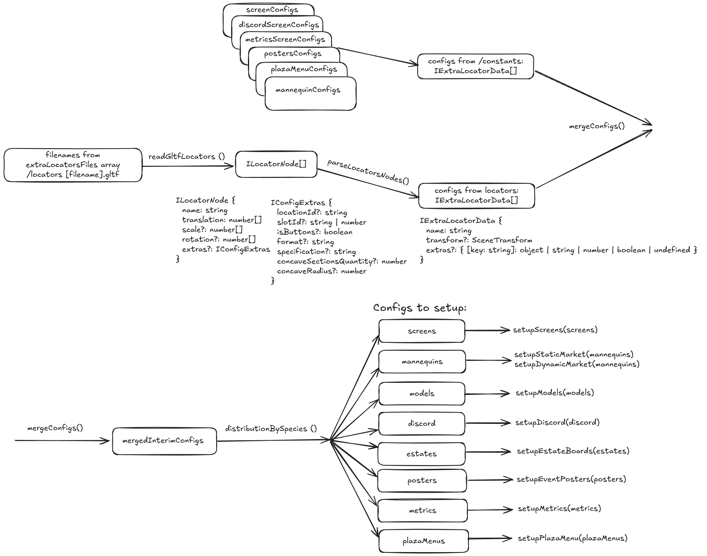

## Shared Scripts

This section contains various functions that have dependencies across different scenes and are used at
various levels of nesting.

- #### connectToBookingsWs.ts && wsConnectionLoop.ts :

  Establishes a connection to the WebSocket. The connection can be made through different endpoints, either with or without an authorization token.

- #### formatSeparator.ts :

  A function for correctly loading models into the scene, depending on the file extension—either .gltf or .glb.

- #### getLocationsTheme.ts :

  Functions that are used to get and set the correct music theme for the scene.

- #### getPosterInfoProps.ts :

  Functions that are used to retrieve the necessary data for setting up posters for upcoming events.

- #### getTeleportToScreenData.ts :

  The getTeleportToScreenData function retrieves all the necessary data for the 2D UI, which can help a
  player teleport to the screen they are currently managing in the DAO HQ Admin Panel.

- #### getTransfFromLocNode.ts :

  A function that takes a parsed node from a locator as an argument and, based on this argument, returns
  the transform data used in the scene.

- #### initialConfigSet.ts :

  Initializes the debug config parameter for the debug menu.

- #### readGltfLocators.ts :

  A function that reads a GLTF file with locators, parses the data, transforms some of it to fit the scene's
  coordinate system, and returns an array of parsed nodes.

- #### useFetch.ts :

  The function fetches data from the provided API with the specified request settings, parses the data, and returns it. It is used to simplify the error handling process.

- #### WebSocketHandler.ts :

  The WebSocketHandler class is a utility for handling WebSocket messages based on their type. It allows you to register event handlers and invoke them when corresponding messages are received.

- #### interactionSystem.ts && locationIdentifier.ts :

  Creates an interaction system for loading data into the scene.

  To add interactive objects into the scene, you need to create new `InteractionSystem` instans. This class allows you to define interactive entities and set up animations and other behaviors.

  Here’s how to use it:

  ```ts
  new InteractionSystem({
    allSavedEntity: Map<string, Entity>,
    entityNames: Array<string>,
    entityStartIndex: Array<EntityStartIndex>,
    animation: any
  })
  ```

  - `allSavedEntity`: A map of all entities and their names.
  - `entityNames`: An array containing the names of all entities from the `.gltf` file.
  - `entityStartIndex`: A map where the key is the first number of the model, and the value is the model name.
  - `animation`: The path to the animation file.
  - `entityNames` - array of all entity names form gltf file

  `entityStartIndex` its array of objects with two fields `startIndex: number` and `modelName: string`

  ##### Example

  ```ts
  entityStartIndex = [{ startIndex: 1, modelName: 'obj_puffer' }]
  ```

  You can then load animations using the `animation` parameter:

  ##### Example

  ```ts
  animation = 'models/emote_sit.glb'

  You can use the `allSavedEntity` map to reference and manipulate all entities within the scene.
  ```

- #### extraLocators.ts :

  Includes functions for the extra locator system, which read locator files, merge their data with configuration data from the /constants directory, and generate configurations for each individual logical segment of the scene.

  A schematic representation of the extra locator system's operation can be seen in the image below.

  ##### 

  ##### Please note the following crucial aspects of the system's operation.

  The scene element setup process can be configured in two ways:

  - Use **\*.gltf locator files** in the /locators directory.
  - Create **configs using TypeScript** in the /src/scene/constants directory.

  These two methods can be used both completely independently and in conjunction with each other.
  All configs, during their processing, are merged into a single data array with a uniform interface, after which they are distributed into logical types.
  It is important to note that configs are **merged by the "name" field**, and the config created using TypeScript in the /src/scene/constants directory **has the highest priority**. This means that all identical fields in the locator files will be overridden by the config with the higher priority.
